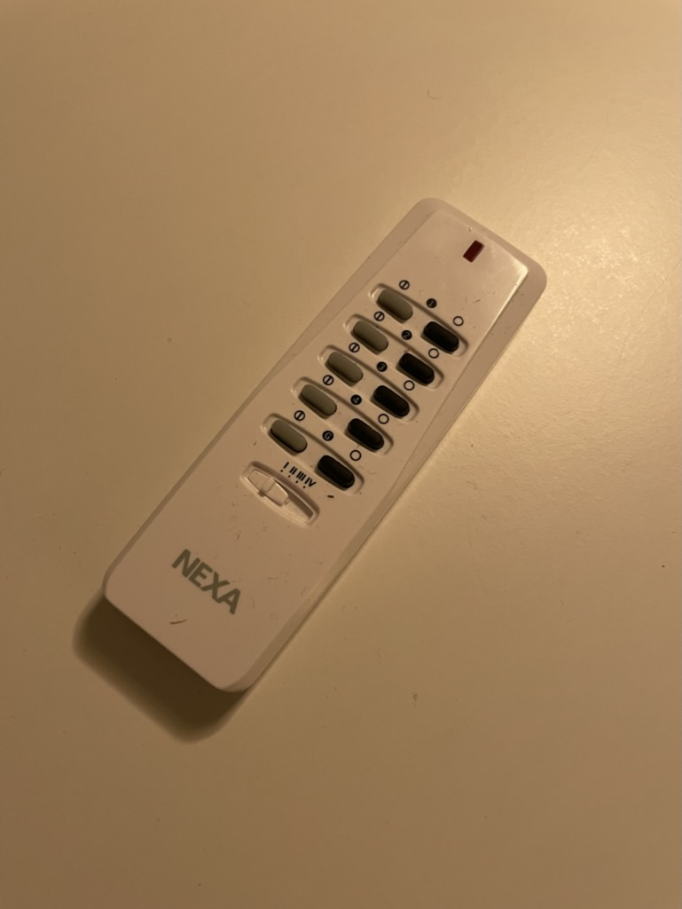
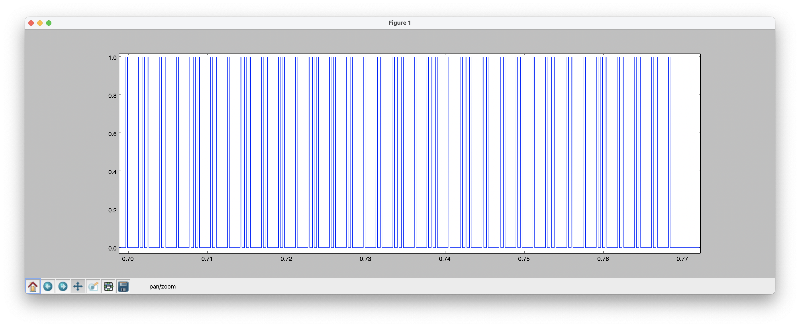

# Pi Nexa Controller

This project describes the controller I use to control my kitchen lights at home. I use a cheap 433mhz transmitter connected to my Raspberry Pi to control Nexa lights in Home Assistant.

# Premise

When we moved into our new apartment, the kitchen was already equipped with [Nexa CMR-101](https://nexa.se/smarta-hem/systemnexa/inbyggnadsmottagare/cmr101) dimmers that was controlled through a wireless switch.


I wanted control the lights with my phone as well. I used a Raspberry Pi with cheap 433mhz wireless transmitter/receivers for this project (like [these](https://www.digitalimpuls.no/tzt-teng/148082/433mhz-rf-transmitter-and-receiver-kit-for-arduino--raspberry-pi--dev-kort)). I also used a separate Nexa-remote to make it easier to sniff signals that were being sent.




First I started with figuring out the ID of the remote I used to control the lights. This was done by listening for signals with the 433mhz receiver, and then plotting them and manually reading the manchester encoded signal. The protocol of the signal used is described [here](https://homeeasyhacking.fandom.com/wiki/Advanced_Protocol).

[This](https://www.instructables.com/Super-Simple-Raspberry-Pi-433MHz-Home-Automation/) blog was also very helpful for reading the signals.

After I figured out my remote ID, I wrote a small Python library (heavily influenced by already existing libraries for this use case) to control the lights, as well as an MQTT-client so I could integrate with Home Assistant that was already running on the Pi.

# Hardware setup

The current setup for actually sending the signals is shown below.


# Listening for signals

To listen for signals. Run the `rf-graph`-script. It will listen for signals for a specified amount of time before quitting. The script will output a json-file that can be plotted using the script in `rf-graph-plot`.



After plotting the signals. You must manually read the manchester encoding to figure out what is being sent.

# Sending signals

To send signals. I have provided a small Python library that subscribes to messages from an MQTT broker and sends manchester encoded 433mhz signals to the lights.

Run `./setup.sh` to set up a docker container connecting to the MQTT broker. The script also expects
to find a file called `config.cfg` that contains relevant configuration. A sample `config.cfg` can be found below.

```
[config]
gpio_pin = 17 # GPIO pin to use. Normally the transmitter is connected to port 17
remote_id = [remote_id] # int remote id sniffed from 433 receiver

[mqtt]
host = [host]
port = [port]
username = [username]
password = [password]
```

Home assistant must also be configured to publish/subscribe to the MQTT-broker. A sample setup is found
in `hass-setup.yml`

# Development

The code is written for Python 3. To run the code outside of Docker you need two packages. `rpi.gpio` and `paho-mqtt`

```
pip3 install rpi.gpio
pip3 install paho-mqtt
```

# Demo

A demo of a working setup controlling Nexa lights through Apple HomeKit and Home Assistant can be found here: https://youtu.be/HXku3B9_a_I

# Next steps

The next step for this project is to listen for incoming 433mhz traffic and store the state of the bulbs. This way the communication will go both ways, and other switches can be used to toggle the lights while maintaining correct state.

# Links

https://www.instructables.com/Super-Simple-Raspberry-Pi-433MHz-Home-Automation/
https://homeeasyhacking.fandom.com/wiki/Advanced_Protocol
https://github.com/henrikjonhed/NexaTransmitterRPi
